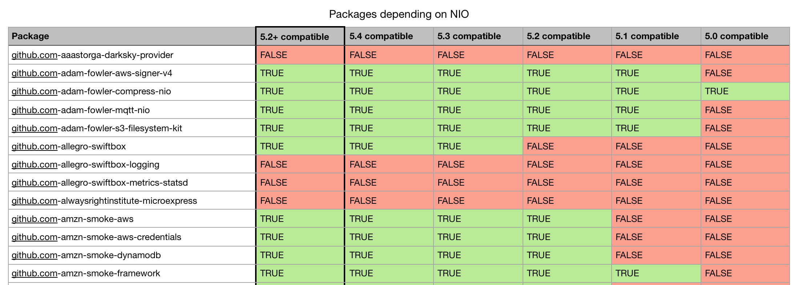

# NIO Dependency Analysis

This repository contains the scripts to answer the question: if NIO was to drop Swift 5.0 and 5.1, how many of its dependencies would be affected?

## Links

- original question: "Is anybody still using SwiftNIO or anything that uses SwiftNIO on Swift 5.0 or 5.1 in production?"
	- https://twitter.com/johannesweiss/status/1397877338277351426?s=21
- https://twitter.com/_sa_s/status/1398286782807035910?s=21
- https://github.com/SwiftPackageIndex/nio-dependency-analysis

## Process

Steps to perform analysis:
- run `nio-analysis.swift` in the checkouts directory containing all package checkouts (copy from builder)
	- loop over package checkouts
	- open `Package.resolved` to see if NIO is among the dependencies
		- if there is no `Package.resolved`, run `swift package dump-package` first
	- log NIO-dependents
- `compatibility.sql`
	- run SQL snippets to compile lists of packages compatible with certain Swift versions
- `playground.sql`
	- copy in results from `nio-analysis.swift` into `nioDependees`
	- copy in results from `compatibility.sql` into the `compatible_5_x` constants
	- run playground to compute the compatibility table
